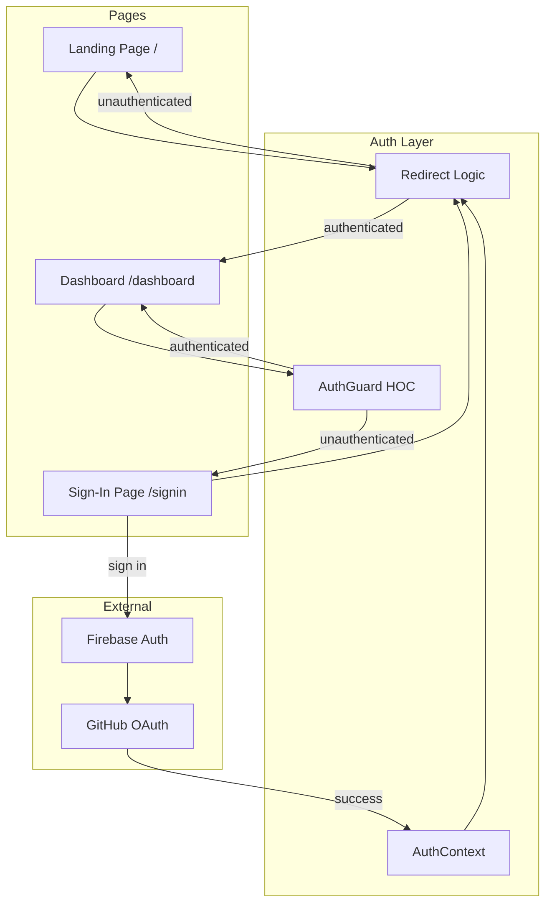
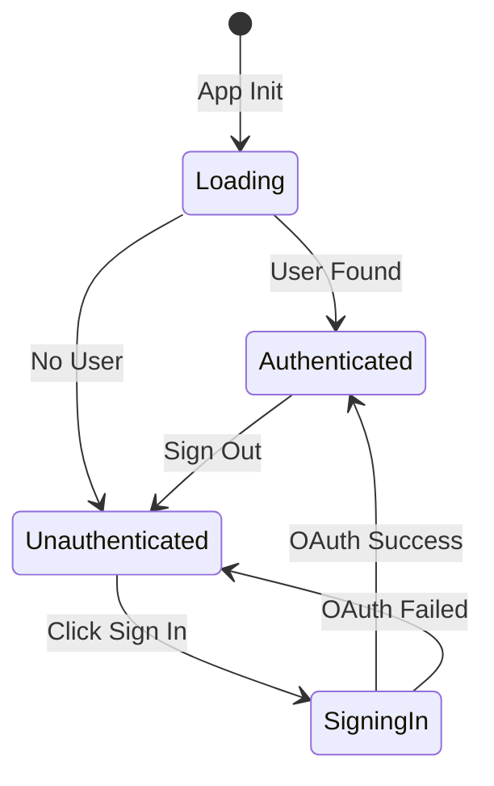

# Design Document: Authentication Flow

## Overview

This design implements a production-ready authentication flow for the Arcanext web application. The system provides a dedicated sign-in page with GitHub OAuth, automatic redirects based on authentication state, and protected route handling. The implementation leverages the existing Firebase authentication infrastructure and AuthContext while adding route protection, redirect logic, and a visually stunning sign-in page that matches the dark theme with purple accents.

## Architecture



### Authentication State Flow



## Components and Interfaces

### 1. Enhanced AuthContext

Extends the existing AuthContext with additional state and methods:

```typescript
interface AuthContextValue {
  // Existing
  currentUser: User | null;
  loading: boolean;
  arcanextUser: ArcanextUser | null;
  signinWithGitHub: () => Promise<UserCredential>;
  signout: () => Promise<void>;
  
  // New
  authError: string | null;
  clearError: () => void;
  isSigningIn: boolean;
}
```

### 2. AuthGuard Component

A higher-order component that protects routes requiring authentication:

```typescript
interface AuthGuardProps {
  children: React.ReactNode;
  fallbackUrl?: string; // Default: '/signin'
}
```

Behavior:
- Shows loading screen while auth state is being determined
- Redirects to sign-in page if unauthenticated
- Preserves original URL in query parameter for post-auth redirect
- Renders children if authenticated

### 3. Sign-In Page Component

A dedicated page for authentication with the following structure:

```
SignInPage
├── UnifiedBackground (existing)
├── Header (simplified, no auth buttons)
└── AuthCard
    ├── Logo + Branding
    ├── Welcome Message
    ├── GitHubSignInButton
    ├── ErrorMessage (conditional)
    └── Footer Links
```

### 4. useAuthRedirect Hook

Custom hook for handling authentication-based redirects:

```typescript
interface UseAuthRedirectOptions {
  redirectAuthenticated?: string; // Where to redirect if authenticated
  redirectUnauthenticated?: string; // Where to redirect if not authenticated
  preserveUrl?: boolean; // Whether to preserve original URL
}

function useAuthRedirect(options: UseAuthRedirectOptions): {
  isRedirecting: boolean;
  targetUrl: string | null;
}
```

## Data Models

### Auth State

```typescript
interface AuthState {
  user: User | null;
  arcanextUser: ArcanextUser | null;
  loading: boolean;
  isSigningIn: boolean;
  error: string | null;
}
```

### Redirect State

```typescript
interface RedirectState {
  returnUrl: string | null; // URL to return to after auth
  isRedirecting: boolean;
}
```

## Correctness Properties

*A property is a characteristic or behavior that should hold true across all valid executions of a system-essentially, a formal statement about what the system should do. Properties serve as the bridge between human-readable specifications and machine-verifiable correctness guarantees.*

### Property 1: Authenticated User Public Page Redirect

*For any* authenticated user state and *for any* public page (landing page or sign-in page), navigating to that page SHALL result in a redirect to the dashboard page.

**Validates: Requirements 3.1, 3.2**

### Property 2: Protected Route Redirect for Unauthenticated Users

*For any* unauthenticated user state and *for any* protected route, navigating to that route SHALL result in a redirect to the sign-in page.

**Validates: Requirements 4.1**

### Property 3: URL Preservation During Redirect

*For any* protected route URL that triggers an unauthenticated redirect, the sign-in page URL SHALL contain the original URL as a query parameter (returnUrl).

**Validates: Requirements 4.2**

### Property 4: Post-Authentication Redirect to Original URL

*For any* sign-in page with a returnUrl query parameter, successful authentication SHALL result in navigation to that returnUrl instead of the default dashboard.

**Validates: Requirements 4.3**

### Property 5: Sign-Out State Cleanup

*For any* authenticated state with user data, invoking sign-out SHALL result in: (a) currentUser being null, (b) arcanextUser being null, and (c) navigation to the landing page.

**Validates: Requirements 5.1, 5.2, 5.3**

## Error Handling

### Authentication Errors

| Error Type | User Message | Recovery Action |
|------------|--------------|-----------------|
| popup_closed_by_user | "Sign-in was cancelled. Please try again." | Clear error, allow retry |
| network_request_failed | "Network error. Please check your connection." | Clear error, allow retry |
| auth/unauthorized-domain | "This domain is not authorized for sign-in." | Display contact support |
| generic | "An error occurred. Please try again." | Clear error, allow retry |

### Error Display

- Errors display in a styled alert below the sign-in button
- Errors auto-clear after 5 seconds or on user interaction
- Error state does not persist across page navigation

## Testing Strategy

### Dual Testing Approach

This feature uses both unit tests and property-based tests:

- **Unit tests**: Verify specific UI rendering, user interactions, and edge cases
- **Property-based tests**: Verify universal redirect and state management properties

### Property-Based Testing

**Library**: fast-check (already compatible with vitest)

**Configuration**: Each property test runs minimum 100 iterations

**Test Annotation Format**: `**Feature: auth-flow, Property {number}: {property_text}**`

### Unit Tests

Unit tests cover:
- Sign-in page renders correctly with all required elements
- Loading states display during auth operations
- Error messages display and clear correctly
- GitHub sign-in button triggers OAuth flow

### Test File Structure

```
web-frontend/
├── __tests__/
│   ├── auth/
│   │   ├── AuthGuard.test.jsx
│   │   ├── SignInPage.test.jsx
│   │   └── auth-properties.test.js
│   └── hooks/
│       └── useAuthRedirect.test.js
```
